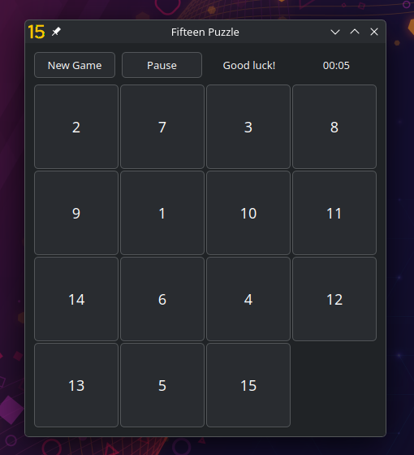

# Fifteen Puzzle

A classic [15-puzzle](https://en.wikipedia.org/wiki/15_puzzle) game built with C++20 and Qt 6.



## Requirements

- C++20 compiler (GCC 12+, Clang 14+, MSVC 2022+)
- Qt 6.2+
- CMake 3.16+

## Build

```bash
cmake -B build -DCMAKE_BUILD_TYPE=Release
cmake --build build --config Release
```

**Linux / macOS:**
```bash
./build/Fifteen
```

**Windows:**
```bat
.\build\Release\Fifteen.exe
```

## Architecture

The project follows a simple MVC pattern:

| File           | Role                                   |
|----------------|----------------------------------------|
| `model.h`      | Game logic                             |
| `view.h`       | Qt UI                                  |
| `controller.h` | Connects model and view via Qt signals |
| `main.cpp`     | Entry point                            |